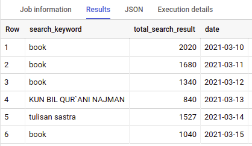
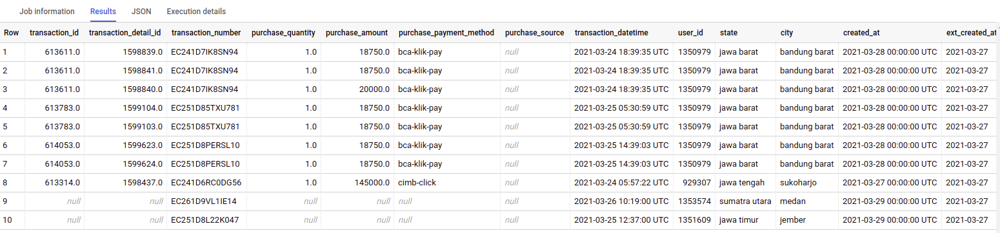

# ETL Google Cloud

ETL Learning Project Using Airflow

## Prerequisite

- Google Cloud Platform

## How to run

- Create a project within Google Cloud Platform
- Create a service account under IAM menu that has permission for Composer, Dataflow, and Bigquery actions
- Create a new bucket in Google Cloud Storage, and upload data that will be used later
- Create a new environment in Google Cloud Composer (it takes about 15-45 minutes)
- After the environment is ready, open airflow web ui and upload `variable.json` as airflow variable
- Create tables in Bigquery, you can do it manually or by running
    ```
    python bigquery/main.py
    ```
- Finally, upload codes in this repo to google composer airflow bucket, unpause the DAGs and the DAGs will run automatically

## What does my code do?

There's two main task, one is to find top keyword from daily keyword search dataset, the other one is to create transactional database from unified user events table.

- Task One, I use 2 kind of approach to solve the problem
  - Bigquery Approach
    
    I use Bigquery to get data from csv, transform, and get the top keywords for each day; resulted in average running time of 15 seconds.

  - Dataflow Approach

    I use Dataflow to get data from csv and transform it to Bigquery table, then get the top keywords for each day using Bigquery operation; resulted in average running time of 5 minutes 30 seconds.

  For this task, using Bigquery was proven to be more efficient in terms of running time and resource.

- Task Two, I haven't explore much about this task and I only use one approach
  - Bigquery and Pandas Approach

    I use Bigquery operation to get the data out of Bigquery table, and process it into transactional data using Pandas. Though it is not efficient, it's effectife enough to get transactional data out of unified user events data.

## Outputs

- Top Search History



- Transactional Table



